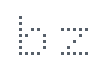

<picture>
  <source media="(prefers-reduced-motion: reduce) and (prefers-color-scheme: dark)" srcset="assets/signature-dark.png">
  <source media="(prefers-reduced-motion: reduce)" srcset="assets/signature-light.png">
  <source media="(prefers-color-scheme: dark)" srcset="assets/signature-dark.gif">
  
</picture>

<h3><samp>bruno zalcberg</samp></h3>

<samp>
computer engineering student @ insper 
previously on exchange @ uc berkeley, harvard 
são paulo, brazil
</samp>

<samp>python · c · c++ · rust · ocaml</samp>

<a href="https://zalcberg.me"><samp>zalcberg.me ↗</samp></a>

